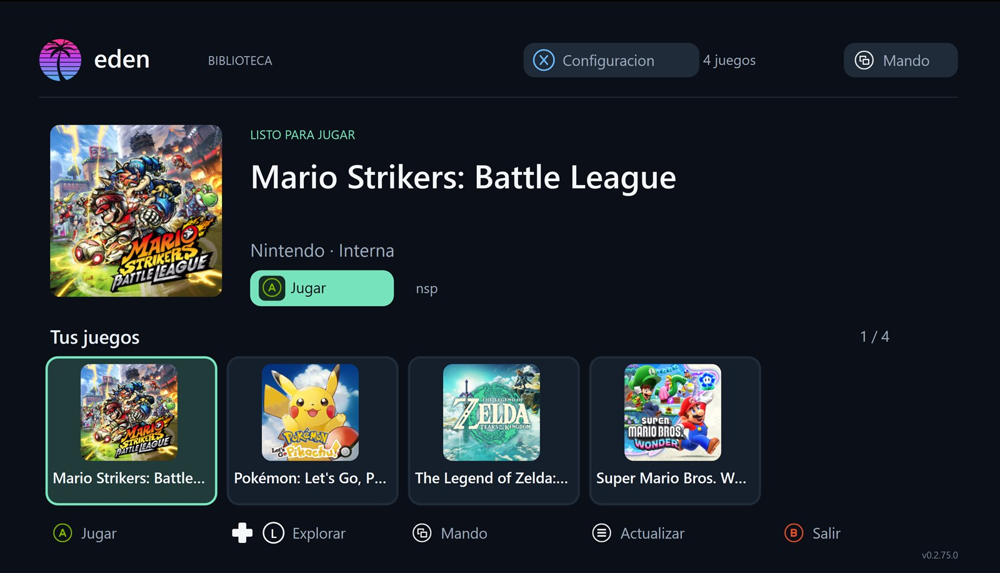
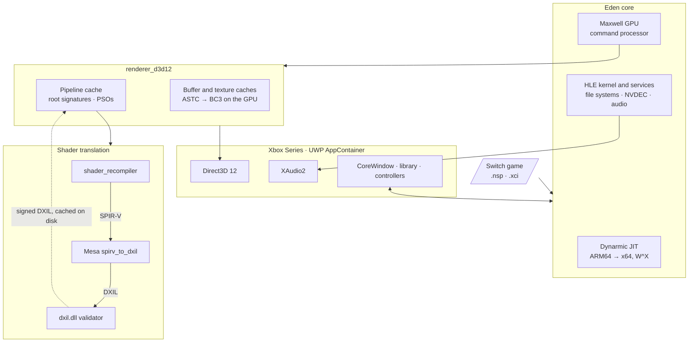

<!--
SPDX-FileCopyrightText: Copyright 2026 Eden Emulator Project
SPDX-License-Identifier: GPL-3.0-or-later
-->

<p align="center">
  
</p>

<h1 align="center">eden-xbox</h1>

<p align="center">
  Eden, the Nintendo Switch emulator, rebuilt as a UWP app for <b>Xbox Series X|S in Developer Mode</b>,<br>
  with a <b>native Direct3D 12 renderer</b> written for this port.
</p>

<p align="center">
  
  <br>
  <sub>The game library, built for a controller on the TV.</sub>
</p>

> **Work in progress.** This is a development fork, not a release. Some games reach gameplay on the
> console, none is free of bugs, and there are no published packages: you build and sign the app
> yourself. Bring your own keys, firmware and game dumps; this repository contains none of them.

**Contents:** [Progress](#progress) · [Architecture](#architecture) ·
[Running it on a console](#running-it-on-a-console) · [Building](#building) ·
[Documentation](#documentation) · [Acknowledgements](#acknowledgements) · [License](#license)

## Progress

### Games

Tested only with dumps of games the tester owns, on a retail Xbox Series X in Developer Mode with
the app in Game mode. Frame rates are for areas whose shaders are already compiled: the first visit
to a new area still stutters while its shaders build.

| Game | Xbox Series X | State |
| --- | --- | --- |
| Pokémon: Let's Go, Pikachu! | **60 FPS**, stable | No graphical errors |
| Mario Strikers: Battle League | **60 FPS** in matches, stable (same on PC) | The Hyper Strike cutscene has a bug that is being fixed; the rest of the match has no graphical errors |
| Super Mario Bros. Wonder | **55–60 FPS**, stable | No crashes or graphical errors |
| The Legend of Zelda: Tears of the Kingdom | Still hits the app's memory limit | On PC it reaches the open world at **30 FPS**, after fixes to vertex fetching and to manual derivatives that broke the first cave |

Audio works without problems in every game above. None of them has been played from start to
finish, so none is called "fully playable" yet.

### Subsystems

| Part | How it is done here | Notes |
| --- | --- | --- |
| Renderer | Own D3D12 backend, modelled on Eden's Vulkan backend | Feature level 11.0, shader model 6.4, no Agility SDK on the console |
| Guest shaders | Eden's recompiler emits SPIR-V, Mesa's `spirv_to_dxil` turns it into DXIL, `dxil.dll` signs it | Guest shaders cached on disk per game and rebuilt in parallel at boot; integer textures lowered to texel fetches |
| CPU | Dynarmic JIT with W^X inside the AppContainer, plus a per-game profile that compiles known code before the game starts | See [The JIT warm-up](#the-jit-warm-up) |
| Guest memory | Placeholder memory through the `*FromApp` APIs, committed on demand | The app has 5120 MiB in Game mode; renderer caches shrink with it, see [The memory guard](#the-memory-guard) |
| Textures | ASTC decoded on the GPU into BC3 (default since 0.2.59) | CPU path kept as `astc=bc3` |
| Audio | XAudio2 2.9 | Same path on PC and Series |
| Front end | Game library with cover art, in-game menu, configuration panel | Imports keys and firmware from a folder; games from `LocalState\games` or external folders |
| Input | Xbox controllers, keyboard on PC | Emulated controller type and per-game language |
| Recovery | A GPU failure returns to the library instead of killing the app | Still being validated on the Series |

## Architecture

The app is one UWP executable. The same package runs on a Windows PC, which is where every change is
tried before it goes to the console.



Where things live:

| Path | What |
| --- | --- |
| `src/eden_uwp/` | Front end: CoreWindow boot, library, in-game menu, controllers, file import, `eden_uwp_diag.txt` |
| `src/video_core/renderer_d3d12/` | The D3D12 renderer: scheduler, buffer and texture caches, pipelines, root signatures, presentation |
| `src/shader_recompiler/` | Eden's shader recompiler, with the adjustments the D3D12 profile needs |
| `tools/xbox/mesa/` | Our additions to Mesa's `spirv_to_dxil` (pipeline linking, integer sampling) |
| `tools/xbox/` | Build, packaging, local run and Mesa build scripts |
| `dist/uwp/` | App manifest and package assets |

Two runtime DLLs are loaded from the package root: `spirv_to_dxil.dll` (built from Mesa by
`tools/xbox/build-spirv-to-dxil.ps1`) and `dxil.dll` (from the Windows SDK). If either is missing,
the renderer falls back to presenting the guest framebuffer through the CPU.

### The JIT warm-up

**The problem.** Dynarmic translates Switch ARM64 code to x64 the first time each block runs. On a
PC that cost hides well, but inside the Xbox sandbox every compile also has to flip the code pages
between writable and executable (W^X is mandatory in the AppContainer), and the console's CPU cores
are slower. So the first minutes of a game, and every new area, were full of small freezes that had
nothing to do with the GPU.

**What this fork does.** It remembers which code a game runs and compiles it before the game starts:

1. While you play, each emulated CPU core records the blocks it compiles: guest address, length and
   a hash of the ARM64 instructions. No host machine code is stored.
2. On exit the list is saved per game, per core and per executable build
   (`LocalState\eden\cache\jit-profile\<title-id>\core-N.bin`), written to a temporary file and
   renamed, so a crash never leaves a half-written profile.
3. On the next launch, before the guest runs, the cores replay their profiles in parallel, each with
   its own JIT and a budget of about 115 MiB of emitted code. The loading screen shows the progress.
4. Learning continues during play, so each session adds what the previous one missed.

**Why it is safe.** A profile is only a hint. Before a block is compiled from it, the block must sit
in executable, non-writable memory that the game loaded, and its instructions must match the stored
hash and length. A profile for another game, another update of the game or another core, or one
with a bad checksum, is discarded and the core simply learns again. A block that fails these checks
is compiled the normal way when the game reaches it. W^X and the normal invalidation of modified
code stay in place, and the warm-up never runs guest code or changes guest state.

**The result.** On PC the preload time fell by about half. It is on by default; `jit_prewarm=0` in
`boot.cfg` turns it off and `jit_prewarm=record` only learns, without the warm-up.

How this compares: Ryujinx's PPTC caches translated host code on disk; this profile stores only
*what* to compile and recompiles it each launch. That costs boot time, but nothing executable is
ever read back from disk.

### The memory guard

**The problem.** In Game mode the whole app gets a hard limit of 5120 MiB, and on the Series the
GPU shares that same memory. A PC emulator assumes it can grow its caches while there is room; on
the console, crossing the limit means the system ends the app with no warning. A fixed cache size
does not work either: what fits in a 2D game is too much in an open world.

**What this fork does.** Once per frame the GPU thread measures two things: the app's commit
against its limit (`Windows.System.MemoryManager`) and the GPU's usage against its DXGI budget. It
keeps a pressure level for each, takes the worse one, and every optional consumer of memory adapts
to it:

| Free memory in the app | Level | What gives way |
| --- | --- | --- |
| More than 512 MiB | Normal | Nothing; textures are evicted at the usual pace |
| 512 MiB or less | Pressure | Texture garbage collection runs more often and evicts more per frame |
| 256 MiB or less | Critical | A second, deeper eviction pass |
| 128 MiB or less | Emergency | Maximum eviction; the cache of linked shaders is dropped; upload ring cut to 128 MiB |
| 64 MiB or less | — | Upload ring cut to 64 MiB; eviction is no longer rate-limited |
| 10 MiB or less | Last resort | The GPU is drained and the upload ring is released entirely |

The GPU budget has its own thresholds at 80, 90 and 97 % of its size.

**Why it is built this way.**
- **Hysteresis.** Each level is entered at one threshold and left only at a higher one (for
  example, Emergency is entered at 128 MiB free and left at 192 MiB). The caches do not flap
  between sizes every frame.
- **No stalls in the normal case.** Ordinary reclamation never waits for the GPU. Only the last
  resort does, because there the alternative is being killed.
- **Nothing in use is freed.** Buffers still referenced by submitted GPU work, and readbacks the
  emulator is waiting on, are kept until their fence passes.
- **It recovers.** After 120 healthy frames with room to spare, the upload ring comes back. A failed
  allocation is retried later instead of every frame.
- **The texture cache never plans for the whole limit.** Its budget is the smaller of the DXGI
  budget and the app limit minus 1.5 GiB, which is left for the emulated Switch's own memory.

Guest memory is handled separately: it is reserved up front and committed only when the game
touches it, so a game that maps a large heap does not use real memory for the parts it never
writes.

## Running it on a console

Requirements: an Xbox Series X|S in Developer Mode, the package you built (see
[Building](#building)), and your own `prod.keys`, `title.keys`, firmware and games.

1. Open the Device Portal at `https://<console-ip>:11443`.
2. Install `eden-xbox.appx` together with its `Microsoft.VCLibs.x64.14.00.appx` dependency.
3. In the app's settings on the console, set it to **Game** mode. Otherwise the memory limit is much
   lower than the 5120 MiB the emulator expects.
4. Start the app. In the configuration panel, import keys and firmware from a folder.
5. Add games: copy them to the app's `LocalState\games` folder with the Device Portal file explorer,
   or add an external folder from the library.

If something fails, `eden_uwp_diag.txt` (in `LocalState`) and `eden\log\eden_log.txt` describe what
happened. The diagnostic switches are listed in [docs/xbox/xbox_deploy.md](docs/xbox/xbox_deploy.md).

## Building

Windows, Visual Studio 2022 with the UWP workload, and the Windows SDK. Run from PowerShell or
`cmd`, not from Git Bash.

```powershell
# Mesa's spirv_to_dxil, once (and whenever tools\xbox\mesa changes)
powershell -ExecutionPolicy Bypass -File tools\xbox\build-spirv-to-dxil.ps1

# Configure and build the app
tools\xbox\build-env.bat cmake --preset uwp-x64
tools\xbox\build-env.bat cmake --build --preset uwp-x64 --target eden-uwp

# Package for the console (build-uwp\package\eden-xbox.appx)
powershell -ExecutionPolicy Bypass -File tools\xbox\package-appx.ps1 -Library

# Or build, register and launch it on this PC
powershell -ExecutionPolicy Bypass -File tools\xbox\local-run.ps1 -Library
```

Full details: [docs/xbox/uwp_build.md](docs/xbox/uwp_build.md) and
[docs/xbox/xbox_deploy.md](docs/xbox/xbox_deploy.md).

## Documentation

The port is documented in [docs/xbox/](docs/xbox/README.md) (in Spanish): design of the D3D12
backend, the shader pipeline, performance measurements, memory, audio, the front end, and the
console test logs, including what went wrong and why.

## Acknowledgements

This fork stands on other people's work:

- [Eden](https://git.eden-emu.dev/eden-emu/eden): the emulator itself. This fork tracks it through
  the [eden-emulator/mirror](https://github.com/eden-emulator/mirror) GitHub mirror.
- [juanresendiz813/eden-xbox](https://github.com/juanresendiz813/eden-xbox): the UWP groundwork
  this fork started from.
- [Mesa](https://gitlab.freedesktop.org/mesa/mesa): `spirv_to_dxil` and the NIR passes behind
  the shader translation.
- yuzu, Ryujinx, Sudachi, Citron, Torzu, Suyu and Ryubing, and everyone who worked on the projects
  Eden comes from.

eden-xbox is an independent fork. It is not affiliated with or endorsed by the Eden project,
Nintendo or Microsoft. Please do not report problems from this fork to Eden.

## License

GNU General Public License v3.0 or later, as Eden. See [LICENSE.txt](LICENSE.txt). Third-party code
keeps its own license and notices.
