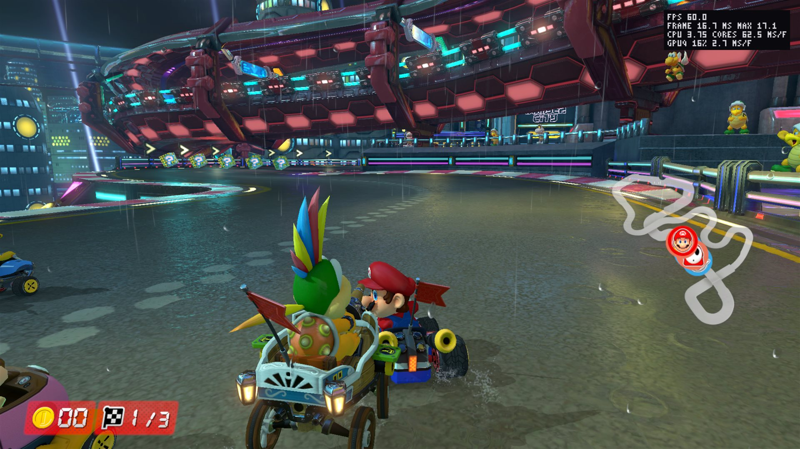
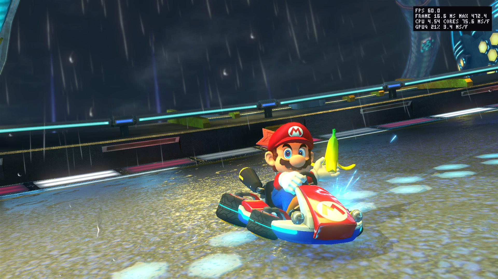
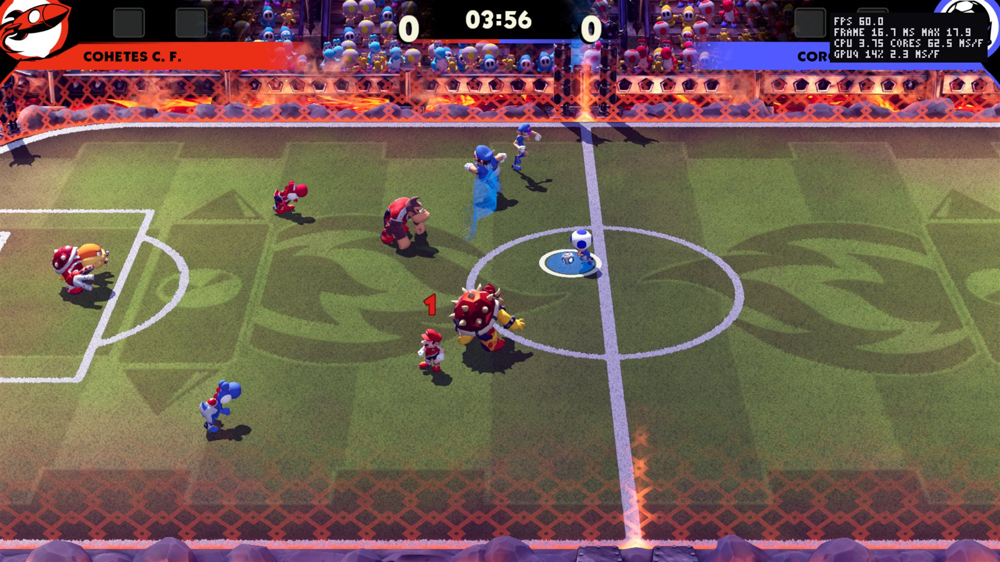
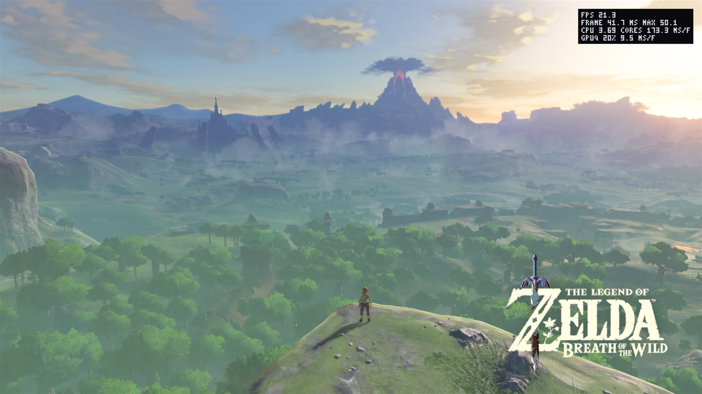
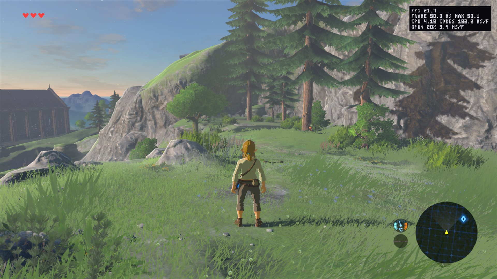
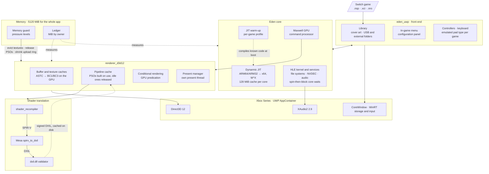

<!--
SPDX-FileCopyrightText: Copyright 2026 Eden Emulator Project
SPDX-License-Identifier: GPL-3.0-or-later
-->

<p align="center">
  
</p>

<h1 align="center">eden-xbox</h1>

<p align="center">
  Eden, the Nintendo Switch emulator, rebuilt as a UWP app for <b>Xbox Series X|S in Developer Mode</b>,<br>
  with a <b>native Direct3D 12 renderer</b> written for this port.<br>
  <b>Mario Kart 8 Deluxe at a locked 60 FPS on Xbox Series X</b> · <a href="#on-the-console">see it running</a>
</p>

<p align="center">
  
  <br>
  <sub>The game library, built for a controller on the TV.</sub>
</p>

> **Work in progress.** This is a development fork, not a release. Some games reach gameplay on the
> console, none is free of bugs, and there are no published packages: you build and sign the app
> yourself. Bring your own keys, firmware and game dumps; this repository contains none of them.

**Contents:** [Progress](#progress) ([games](#games), [screenshots](#on-the-console),
[the memory wall](#the-memory-wall)) · [Architecture](#architecture) ·
[Running it on a console](#running-it-on-a-console) · [Building](#building) ·
[Documentation](#documentation) · [Acknowledgements](#acknowledgements) · [License](#license)

## Progress

### Games

Tested only with dumps of games the tester owns, on a retail Xbox Series X in Developer Mode with
the app in Game mode. Frame rates are for areas whose shaders are already compiled: the first visit
to a new area still stutters while its shaders build.

| Game | Xbox Series X | State |
| --- | --- | --- |
| Mario Kart 8 Deluxe | **60 FPS** in races, stable | No graphical errors. The first 32-bit game of the list; the JIT warm-up covers 32-bit games too |
| Mario Strikers: Battle League | **60 FPS** in matches, stable | No graphical errors, Hyper Strike cutscenes included |
| Pokémon: Let's Go, Pikachu! | **60 FPS**, stable | No graphical errors |
| Super Mario Bros. Wonder | **55–60 FPS**, stable | No crashes or graphical errors |
| The Legend of Zelda: Breath of the Wild | **About 20 FPS** in the open world, of the game's 30 | **Work in progress.** Renders without graphical errors; limited by the emulated CPU, see [Work in progress](#work-in-progress-breath-of-the-wild) |
| The Legend of Zelda: Tears of the Kingdom | Renders **without graphical errors**, then **hits the memory wall** | The heaviest loads need more than the app's 5120 MiB, see [The memory wall](#the-memory-wall). On PC it reaches the open world at **30 FPS** |

Audio works without problems in every game above. None of them has been played from start to
finish, so none is called "fully playable" yet.

### On the console

Captured on a retail Xbox Series X from the Device Portal, at the console's 4K output. The overlay
in the top right corner is the app's own: frame rate, frame time with its worst case, emulated CPU
load and GPU time per frame.

**Mario Kart 8 Deluxe runs at a locked 60 FPS on the Series X** once its shaders are compiled. In
the race below every frame takes 16.7 ms and the slowest one 17.1 ms: no drops, with rain and the
whole track on screen. The GPU is busy only 16 % of the time, so there is plenty of room left for
the graphics.

<table>
  <tr>
    <td colspan="2" align="center">
      
      <br>
      <sub><b>Mario Kart 8 Deluxe</b>: mid-race at 60 FPS, 16.7 ms per frame, slowest frame 17.1 ms.</sub>
    </td>
  </tr>
  <tr>
    <td width="50%" align="center">
      
      <br>
      <sub><b>Mario Kart 8 Deluxe</b>: rain, reflections and particles at 60 FPS. The 472 ms worst
      frame is a shader being compiled the first time the effect appears; it does not repeat.</sub>
    </td>
    <td width="50%" align="center">
      
      <br>
      <sub><b>Mario Strikers: Battle League</b>: a match at 60 FPS, GPU at 14 %.</sub>
    </td>
  </tr>
</table>

#### Work in progress: Breath of the Wild

Breath of the Wild already draws its open world correctly on the Series, but it runs at about
20 FPS where the game targets 30. The overlay shows where the time goes: the GPU needs only about
9.5 ms of each 50 ms frame, while the emulated CPU keeps close to four host cores busy. The bottleneck
is the CPU emulation, which inside the Xbox sandbox has to go through a page table for every guest
memory access (fastmem is impossible there, see [The memory wall](#the-memory-wall)). This is the
next target for optimisation.

<table>
  <tr>
    <td width="50%" align="center">
      
      <br>
      <sub><b>Breath of the Wild</b>: the whole of Hyrule in view at 21 FPS, GPU 9.5 ms per frame.</sub>
    </td>
    <td width="50%" align="center">
      
      <br>
      <sub><b>Breath of the Wild</b>: the Great Plateau at 21 FPS, no graphical errors.</sub>
    </td>
  </tr>
</table>

### Subsystems

| Part | How it is done here | Notes |
| --- | --- | --- |
| Renderer | Own D3D12 backend, modelled on Eden's Vulkan backend | Feature level 11.0, shader model 6.4, no Agility SDK on the console. See [Inside the renderer](#inside-the-renderer) |
| Guest shaders | Eden's recompiler emits SPIR-V, Mesa's `spirv_to_dxil` turns it into DXIL, `dxil.dll` signs it | Cached on disk per game and rebuilt in parallel at boot; integer textures lowered to texel fetches |
| Pipelines | A pipeline keeps its DXIL; its PSO is built when it is drawn and released when it sits idle | The pipelines of recent sessions are built at boot (`d3d12_hot.bin`); pipelines share one copy of each stage's bindings |
| Conditional rendering | Evaluated on the GPU with `SetPredication` | The GPU thread no longer waits for query results each frame |
| CPU | Dynarmic JIT with W^X inside the AppContainer, 64-bit and 32-bit games | Code cache capped at 128 MiB per core on Xbox (`jit_cache_mib`); a per-game profile compiles known code before the game starts, see [The JIT warm-up](#the-jit-warm-up) |
| Emulated cores | Idle cores spin briefly (`MWAITX`/`UMWAIT`/`pause`) before blocking | Handoffs between cores skip most of the ~40 µs OS wake latency |
| Guest memory | Placeholder memory through the `*FromApp` APIs, committed on demand; fiber stacks grow on demand | No fastmem: every guest access goes through a page table |
| App memory | A memory guard that shrinks the caches as the 5120 MiB limit nears, and a ledger of who owns each MiB | See [The memory guard](#the-memory-guard) and [The memory wall](#the-memory-wall) |
| Textures | ASTC decoded on the GPU into BC3, or BC1 when the texture has no alpha; arrays included | `astc=bc3` keeps the CPU path, `astc_opaque=bc3` keeps every ASTC texture as BC3, `astc_arrays=rgba` keeps arrays in RGBA8 |
| Audio | XAudio2 2.9 | Same path on PC and Series |
| Front end | Game library with cover art, in-game menu (View + Menu held), configuration panel | Imports keys and firmware from a folder; games from `LocalState\games` or external folders and USB drives |
| Input | Xbox controllers, keyboard on PC with rebindable keys | Emulated controller type (Pro, Joy-Cons, handheld) chosen per game; a chosen pad that disconnects is never silently replaced |
| Recovery | A GPU failure returns to the library instead of killing the app | Still being validated on the Series |

### The memory wall

Tears of the Kingdom is where this port meets its hardest limit. On the Series it draws correctly,
but in the heaviest area loads the app runs out of memory: the renderer cannot create a buffer and
the game returns to the library.

**Why it does not fit.** In Game mode the whole app gets 5120 MiB, and the GPU shares that memory.
The Switch gives the game about 3.2 GiB, and this game uses almost all of it. An emulator then needs
room of its own: its JIT, its shaders and pipelines, and above all a second copy of every texture.
The game's textures sit in the emulated memory, and the GPU needs them again in a format of its own.
On a PC the second copy goes to the graphics card's memory; on the Series it counts against the same
5120 MiB.

Measured on PC, without the limit, in the load that fails on the Series:

| What | MiB | Can it shrink? |
| --- | --- | --- |
| Emulated Switch memory | 2460 | No: it is the game's own memory |
| Textures on the GPU | 1000 live in the load, up to 2000 with no limit to evict them | Only by evicting sooner or by lowering their resolution |
| Allocations of the emulator itself (C++ heaps) | 750 | Partly: about 400 MiB are large blocks not attributed yet |
| Other GPU memory (upload ring, buffers) | 460 | Already cut |
| JIT code cache | 300–400 | Now capped at 128 MiB per core; smaller caps mean more recompilation |
| The executable and its DLLs | 200 | No |

Without the textures that is about 4.25 GiB, which leaves some 870 MiB for textures under the
limit. The failing load keeps about 1000 MiB of them in use at the same time. Without the limit the
app peaks around 6.4 GiB.

**What has been cut so far:**
- PSOs are built when a pipeline is drawn and released when it sits idle, instead of all of them
  living for the whole session (about 100 KiB each, 1.3 GiB for 17 000 pipelines in one game).
- Graphics pipelines share what they read from each shader: 160 MiB → 26 MiB over 15 000 pipelines.
- The JIT code cache is capped at 128 MiB per core, and its per-block metadata is compact: link
  sites went from ~230 to ~40 bytes, block ranges from ~385 to 16–24 bytes.
- Fiber stacks commit 64 KiB and grow on demand, instead of 4 MiB each up front (about 500 MiB for
  126 fibers).
- ASTC texture arrays are recompressed to BC3 too: one array of 121 layers went from 650 MiB to a
  quarter of that.
- Texture descriptor tables are sized by the game's limit instead of a fixed 16 MiB each.
- The system fonts are loaded once instead of once per service.
- The upload ring is at most 128 MiB.
- Textures start being evicted with 768 MiB still free.
- A buffer or texture the system refuses is retried after memory is reclaimed.
- ASTC textures without alpha are re-encoded as BC1, half the size of BC3. This game uses few of
  them, so it gains little here.

**What comes next:**
- Find out what the ~400 MiB of large heap blocks are and cut them.
- An option to lower the resolution of the largest textures. It costs sharpness, but it would leave
  enough room for the heaviest loads.

Fitting in memory is not the end of it. Fastmem, which mirrors the Switch's address space in the
host's so that JIT code reaches guest memory with a single instruction, is impossible inside the
Xbox sandbox. Every memory access of the emulated CPU goes through a page table instead, and this
game leans hard on the CPU. Its frame rate on the Series is still unknown.

## Architecture

The app is one UWP executable. The same package runs on a Windows PC, which is where every change is
tried before it goes to the console.



Where things live:

| Path | What |
| --- | --- |
| `src/eden_uwp/` | Front end: CoreWindow boot, library, in-game menu, controllers and keyboard, file import, external storage, `eden_uwp_diag.txt` |
| `src/dynarmic/` | The JIT, with W^X for the AppContainer, the warm-up profiles and compact block metadata |
| `src/common/` | Shared pieces this port added to: the memory ledger, the spin-then-block core wait, fiber stacks that grow on demand |
| `src/video_core/renderer_d3d12/` | The D3D12 renderer: scheduler, buffer and texture caches, pipelines, root signatures, presentation (see [Inside the renderer](#inside-the-renderer)) |
| `src/shader_recompiler/` | Eden's shader recompiler, with the adjustments the D3D12 profile needs |
| `tools/xbox/mesa/` | Our additions to Mesa's `spirv_to_dxil` (pipeline linking, integer sampling) |
| `tools/xbox/` | Build, packaging, local run, Mesa build and crash symbolication scripts |
| `tools/xbox/tests/` | Standalone tests of the pure policies: memory guard, PSO residency, JIT warm-up, controllers, library |
| `dist/uwp/` | App manifest and package assets |

Two runtime DLLs are loaded from the package root: `spirv_to_dxil.dll` (built from Mesa by
`tools/xbox/build-spirv-to-dxil.ps1`) and `dxil.dll` (from the Windows SDK). If either is missing,
the renderer falls back to presenting the guest framebuffer through the CPU.

### Inside the renderer

`renderer_d3d12` follows the layout of Eden's Vulkan backend. The generic `TextureCache`,
`BufferCache`, `ShaderCache` and `FenceManager` templates, the Vulkan `StateTracker` and
`FixedPipelineState` are shared; the D3D12 part supplies their runtimes. Each file has one job:

| Area | Files | What |
| --- | --- | --- |
| Device and submission | `d3d12_device`, `d3d12_scheduler`, `d3d12_fence_manager`, `d3d12_query_cache` | Device, direct queue, command lists and allocators, GPU ticks, deferred releases, guest fences and queries |
| Presentation | `renderer_d3d12`, `d3d12_present_manager`, `d3d12_swapchain`, `d3d12_present_blit`, `d3d12_present_cpu`, `d3d12_overlay` | Composites each frame into a frame of its own; a dedicated thread copies it to the swapchain and presents (see below) |
| Draws | `d3d12_rasterizer*`, `d3d12_accelerate_dma`, `d3d12_maxwell_to_d3d12`, `d3d12_indirect_buffer`, `d3d12_conditional_rendering` | Draw state, clears, DMA, indirect draws rebuilt for `ExecuteIndirect`, conditional rendering by GPU predication |
| Pipelines | `d3d12_graphics_pipeline`, `d3d12_compute_pipeline`, `d3d12_root_signature`, `d3d12_stage_bindings`, `d3d12_pipeline_residency` | PSOs and their root arguments, stage bindings shared between pipelines, which PSOs stay built |
| Shaders | `d3d12_pipeline_cache`, `d3d12_shader_compiler`, `d3d12_linked_shader_cache` | SPIR-V → DXIL translation on worker threads, the per-game disk cache of guest pipelines, reuse of linked shaders |
| Textures | `d3d12_texture_cache`, `d3d12_image_*`, `d3d12_depth_stencil_transfer`, `d3d12_astc_gpu_decoder`, `d3d12_sampler`, `d3d12_framebuffer`, `d3d12_texture_formats` | Images, views, uploads and downloads, copies and blits, ASTC on the GPU |
| Helper shaders | `d3d12_blit_image`, `d3d12_blit_compute` | Blits, masked clears, depth-stencil packing, ASTC decode and BC1/BC3 encode |
| Memory | `d3d12_buffer_cache`, `d3d12_staging_buffer_pool`, `d3d12_transfer_buffer_pool`, `d3d12_resource_allocator`, `d3d12_heap_packing`, `d3d12_gc_readback`, `d3d12_memory_guard`, `d3d12_cache_policy` | Buffers, the upload ring, reused GPU scratch buffers, placed texture heaps and their packing, the memory guard and its pressure levels |
| Binding | `d3d12_descriptor_heap`, `d3d12_barrier_batch`, `d3d12_pipeline_helper`, `d3d12_resource_utils` | Descriptor ring and sampler heap, batched barriers, helpers shared by draws and dispatches |
| Diagnostics | `diagnostics/` | Draw trace, frame dumps, performance report, pipeline and ASTC checks; kept off the hot paths |

**Presentation.** The GPU thread composites each frame into one of three textures of its own and
submits it. A separate thread (`D3D12Present`) waits on the swapchain's frame latency waitable object,
copies the frame into the back buffer and presents it, so the GPU thread never waits for the display.
Both threads submit to the same queue under one lock, because `Present` and `ExecuteCommandLists`
racing on two threads can deadlock. Without a waitable swapchain, or with `async_present=0` in
`boot.cfg`, presentation runs on the GPU thread as before.

### The JIT warm-up

**The problem.** Dynarmic translates Switch ARM64 code to x64 the first time each block runs. On a
PC that cost hides well, but inside the Xbox sandbox every compile also has to flip the code pages
between writable and executable (W^X is mandatory in the AppContainer), and the console's CPU cores
are slower. So the first minutes of a game, and every new area, were full of small freezes that had
nothing to do with the GPU.

**What this fork does.** It remembers which code a game runs and compiles it before the game starts:

1. While you play, each emulated CPU core records the blocks it compiles: guest address, length and
   a hash of the ARM64 instructions. No host machine code is stored.
2. On exit the list is saved per game, per core and per executable build
   (`LocalState\eden\cache\jit-profile\<title-id>\core-N.bin`), written to a temporary file and
   renamed, so a crash never leaves a half-written profile.
3. On the next launch, before the guest runs, the cores replay their profiles in parallel, each with
   its own JIT and a budget of emitted code. The loading screen shows the progress.
   The budget is learned per game: 64 MiB per core by default, then 32 and 16. A session whose free
   memory fell below 256 MiB lowers the next one a step; a long session that always kept 1 GiB free
   raises it back. A full profile at 115 MiB per core used to cost one game 1 GiB of the limit.
4. Learning continues during play, so each session adds what the previous one missed.

**Why it is safe.** A profile is only a hint. Before a block is compiled from it, the block must sit
in executable, non-writable memory that the game loaded, and its instructions must match the stored
hash and length. A profile for another game, another update of the game or another core, or one
with a bad checksum, is discarded and the core simply learns again. A block that fails these checks
is compiled the normal way when the game reaches it. W^X and the normal invalidation of modified
code stay in place, and the warm-up never runs guest code or changes guest state.

**The result.** On PC the preload time fell by about half. It is on by default; `jit_prewarm=0` in
`boot.cfg` turns it off and `jit_prewarm=record` only learns, without the warm-up.

How this compares: Ryujinx's PPTC caches translated host code on disk; this profile stores only
*what* to compile and recompiles it each launch. That costs boot time, but nothing executable is
ever read back from disk.

### The memory guard

**The problem.** In Game mode the whole app gets a hard limit of 5120 MiB, and on the Series the
GPU shares that same memory. Past the limit, the system refuses new commits
(`CreateCommittedResource` returns `E_OUTOFMEMORY`). An app left over the limit is suspended after
two seconds. A PC emulator assumes it can grow its caches while there is room. A fixed cache size
does not work either: what fits in a 2D game is too much in an open world.

**What this fork does.** Once per frame the GPU thread measures two things: the app's commit
against its limit (`Windows.System.MemoryManager.AppMemoryUsage`, the same figure the system's
Resource Manager enforces) and the GPU's usage against its DXGI budget. It keeps a pressure level
for each, takes the worse one, and every optional consumer of memory adapts to it:

| Free memory in the app | Level | What gives way |
| --- | --- | --- |
| More than 768 MiB | Normal | Nothing; textures are evicted at the usual pace |
| 768 MiB or less | Pressure | Texture garbage collection runs more often and evicts more per frame |
| 384 MiB or less | Critical | A second, deeper eviction pass |
| 192 MiB or less | Emergency | Maximum eviction |
| 128 MiB or less | — | Retired upload buffers are freed; the linked shader cache is emptied |
| 64 MiB or less | — | Upload ring cut to 64 MiB; eviction is no longer rate-limited |
| 32 MiB or less | Last resort | The GPU is drained and the upload ring drops to its 32 MiB floor |

Compiled PSOs follow the same pressure. One idle for three minutes is released, and rebuilt from
its kept DXIL if it is drawn again; as the thresholds near, ten seconds of idleness are enough, and
one second in an emergency.

The levels start early because a loading screen can add 500 MiB of textures, buffers and emulated
memory in ten seconds.

The GPU budget has its own thresholds at 80, 90 and 97 % of its size.

Between two measurements, allocations are checked too. Each new upload or readback buffer is
subtracted from the last measured headroom. When that estimate nears a 64 MiB reserve, the guard
measures again. If the buffer would cross the reserve, it first gives memory back: retired buffers
are freed, work already submitted to the GPU is waited for, and a buffer it releases is reused
instead of creating a new one. If the system still refuses a commit (a staging buffer or a
texture), the same reclamation runs and the allocation is retried once.

**Why it is built this way.**
- **Hysteresis.** Each level is entered at one threshold and left only at a higher one (for
  example, Emergency is entered at 192 MiB free and left at 256 MiB). The caches do not flap
  between sizes every frame.
- **No stalls in the normal case.** Ordinary reclamation never waits for the GPU. Near the reserve
  it waits only for work already submitted, at most once per command list, and never splits a draw
  being recorded. Only the last resort drains the GPU.
- **Nothing in use is freed.** Buffers still referenced by submitted GPU work, and readbacks the
  emulator is waiting on, are kept until their fence passes.
- **It recovers, one step at a time.** The upload ring grows back from 32 to 64 and 128 MiB.
  Each step needs its new size plus 256 MiB free for 120 frames in a row. If a shrink follows a
  growth, the next growth needs twice as long (up to two minutes), so a game living near the limit
  settles instead of oscillating. The linked shader cache comes back after ten seconds with
  768 MiB free. A failed ring allocation is retried 120 frames later, not every frame.
- **Little waste in upload buffers.** Large ones are sized in sixteenths of a power of two, so
  they commit less than 12.5 % more than requested. A 17 MiB upload takes 18 MiB, where it used to
  take 32.
- **The texture cache never plans for the whole limit.** Its budget is the smaller of the DXGI
  budget and the app limit minus 1.5 GiB, which is left for the emulated Switch's own memory.
- **Tested in isolation.** Every threshold and transition lives in
  `src/video_core/renderer_d3d12/d3d12_memory_guard.h`, which has no device dependency, and is
  checked by `tools/xbox/tests/memory-guard.cpp`.

Guest memory is handled separately: it is reserved up front and committed only when the game
touches it, so a game that maps a large heap does not use real memory for the parts it never
writes.

**Knowing who owns the memory.** A ledger (`src/common/memory_ledger.h`) charges every large
consumer as it allocates: texture heaps, buffers, upload rings, shader bytecode, pipelines and built
PSOs, plus the emulated DRAM and the JIT's committed code. The diag's heartbeat prints the memory by
owner and what nobody accounts for. With `memory_audit=1` in `boot.cfg` the heaps and the memory map
are written every minute of play, and again whenever free memory drops below 150 MiB. On a PC, `memory_limit_mib` in
`boot.cfg` caps the process from inside with a job object, so a PC run hits the same wall as the
Series.

### The bug tracker

**The problem.** The first run of Mario Strikers: Battle League turned up a series of bugs. About
thirty pipelines were rejected for sampling integer textures, geometry shaders wrote to streams,
the GPU hung, an nvmap assert fired and the movie player aborted. Each had to be dug out of
`eden_log.txt`. That was hard for three reasons:
- Unsupported features are reported only once per process, or not at all (unsupported texture
  formats, for example).
- Lost draws are never counted.
- Every `UNIMPLEMENTED` ends up mixed into the general log.

**What this fork does.** The tracker deduplicates and counts these bugs and writes them to two
files of their own in `LocalState\eden\log\`:
- `eden_graphics_bugs.log` holds one line per bug the first time it appears. Each line gives the
  time, frame, category, source location and context (shader hashes, format, HRESULT). A table
  with the counts follows at exit.
- `eden_graphics_bugs.json` is the same summary for scripts. For each bug it lists hits, first and
  last frame, the first message, and per-detail counts (one per format, shader pair or HRESULT).

It covers:
- the renderer: dropped draws and dispatches, rejected pipelines, shader recompilation and DXIL
  failures, ignored state, formats with no DXGI equivalent, skipped copies and blits, failed API
  calls, device removal, and NaN/Inf in trace mode;
- the GPU engines, nvdrv and nvmap;
- guest panics;
- every `UNIMPLEMENTED`, `ASSERT`, `UNREACHABLE` and logged stub in the emulator, at its real
  source location.

Warnings reach the tracker even when `log_filter` hides them. `bug_tracker=0` in `boot.cfg`
turns the tracker off. To get the files off a console, use the Device Portal file explorer
(LocalAppData → the package → LocalState → eden → log).

**Why it is built this way.**
- **Close to free.** Each call site owns its counters, held in static storage. A repeated hit of a
  known bug costs a few relaxed loads and stores: no locked instruction, no call, no allocation, and
  the message arguments are not evaluated. Measured: about 1 ns per hit, and 0.3 ns when the
  tracker is off.
- **Messages are formatted once per bug.** That happens in a cold, out-of-line function, which hands
  the message to a bounded lock-free queue and never blocks.
- **No file I/O on emulator threads.** A writer thread at the lowest priority appends the lines
  about once a second. It rewrites the JSON at most every ten seconds, and only when a count
  changed. A device removal, guest panic or game exit flushes at once.
- **Crash safe.** The crash handlers append the lines still queued, using plain C stdio without
  locks.
- **Reported once.** A log that sits next to a tracked site is muted for the tracker, so the same
  bug does not appear twice.
- **Tested in isolation.** `tools/xbox/tests/bug-tracker.cpp` covers deduplication, concurrency, the
  queue, classification, the files end to end, and the cost.

## Running it on a console

Requirements: an Xbox Series X|S in Developer Mode, the package you built (see
[Building](#building)), and your own `prod.keys`, `title.keys`, firmware and games.

1. Open the Device Portal at `https://<console-ip>:11443`.
2. Install `eden-xbox.appx` together with its `Microsoft.VCLibs.x64.14.00.appx` dependency.
3. In the app's settings on the console, set it to **Game** mode. Otherwise the memory limit is much
   lower than the 5120 MiB the emulator expects.
4. Start the app. In the configuration panel, import keys and firmware from a folder.
5. Add games: copy them to the app's `LocalState\games` folder with the Device Portal file explorer,
   or add an external folder from the library.

If something fails, `eden_uwp_diag.txt` (in `LocalState`) and `eden\log\eden_log.txt` describe what
happened. The diagnostic switches are listed in [docs/xbox/xbox_deploy.md](docs/xbox/xbox_deploy.md).

## Building

Windows, Visual Studio 2022 with the UWP workload, and the Windows SDK. Run from PowerShell or
`cmd`, not from Git Bash.

```powershell
# Mesa's spirv_to_dxil, once (and whenever tools\xbox\mesa changes)
powershell -ExecutionPolicy Bypass -File tools\xbox\build-spirv-to-dxil.ps1

# Configure and build the app
tools\xbox\build-env.bat cmake --preset uwp-x64
tools\xbox\build-env.bat cmake --build --preset uwp-x64 --target eden-uwp

# Package for the console (build-uwp\package\eden-xbox.appx)
powershell -ExecutionPolicy Bypass -File tools\xbox\package-appx.ps1 -Library

# Or build, register and launch it on this PC
powershell -ExecutionPolicy Bypass -File tools\xbox\local-run.ps1 -Library
```

Full details: [docs/xbox/uwp_build.md](docs/xbox/uwp_build.md) and
[docs/xbox/xbox_deploy.md](docs/xbox/xbox_deploy.md).

## Documentation

The port is documented in [docs/xbox/](docs/xbox/README.md) (in Spanish): design of the D3D12
backend, the shader pipeline, performance measurements, memory, audio, the front end, and the
console test logs, including what went wrong and why.

## Acknowledgements

This fork stands on other people's work:

- [Eden](https://git.eden-emu.dev/eden-emu/eden): the emulator itself. This fork tracks it through
  the [eden-emulator/mirror](https://github.com/eden-emulator/mirror) GitHub mirror.
- [juanresendiz813/eden-xbox](https://github.com/juanresendiz813/eden-xbox): the UWP groundwork
  this fork started from.
- [Mesa](https://gitlab.freedesktop.org/mesa/mesa): `spirv_to_dxil` and the NIR passes behind
  the shader translation.
- yuzu, Ryujinx, Sudachi, Citron, Torzu, Suyu and Ryubing, and everyone who worked on the projects
  Eden comes from.

eden-xbox is an independent fork. It is not affiliated with or endorsed by the Eden project,
Nintendo or Microsoft. Please do not report problems from this fork to Eden.

## License

GNU General Public License v3.0 or later, as Eden. See [LICENSE.txt](LICENSE.txt). Third-party code
keeps its own license and notices.
